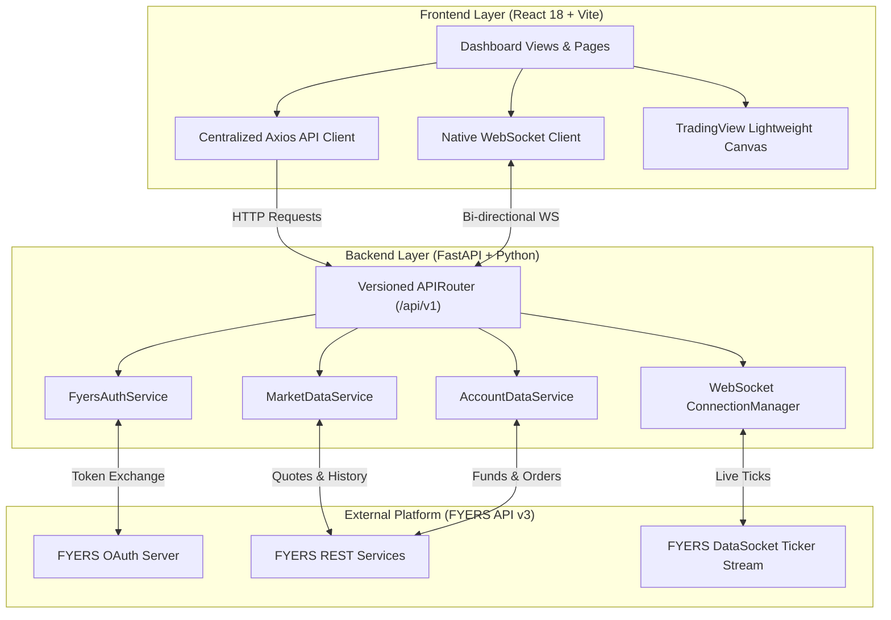
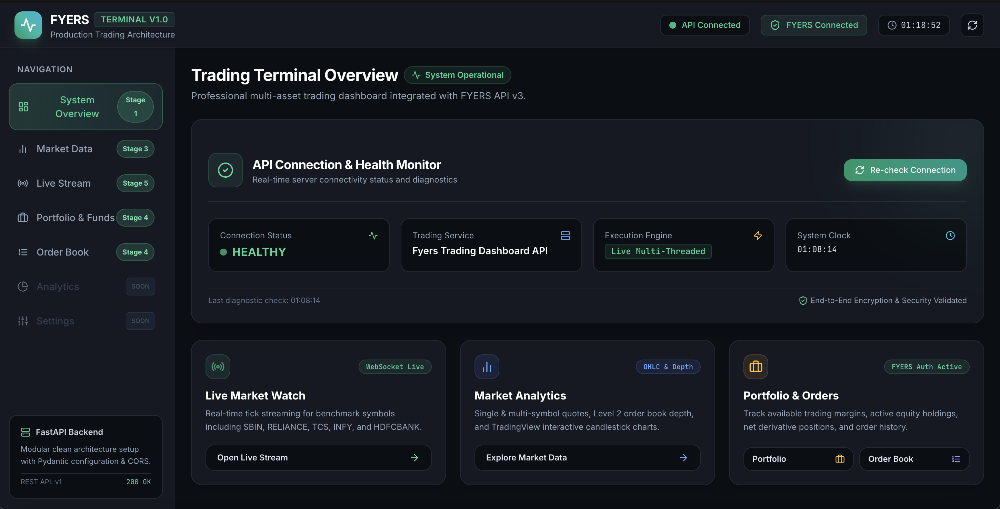
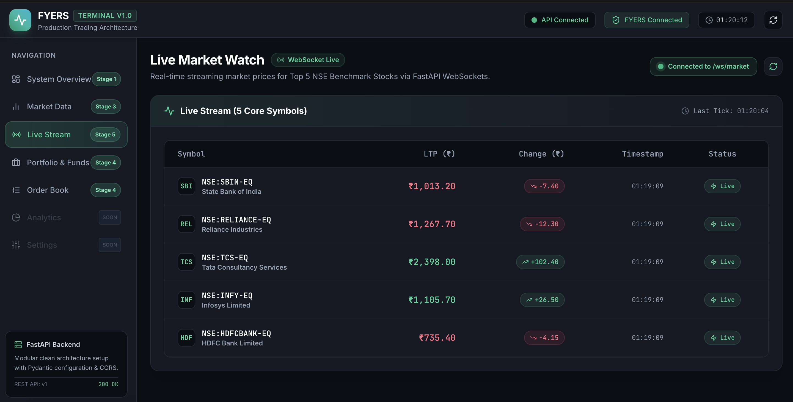
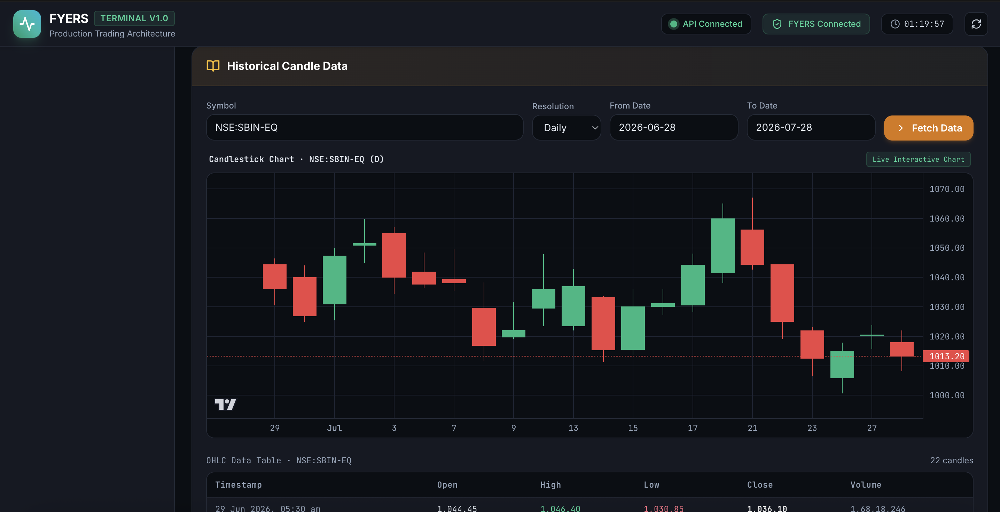
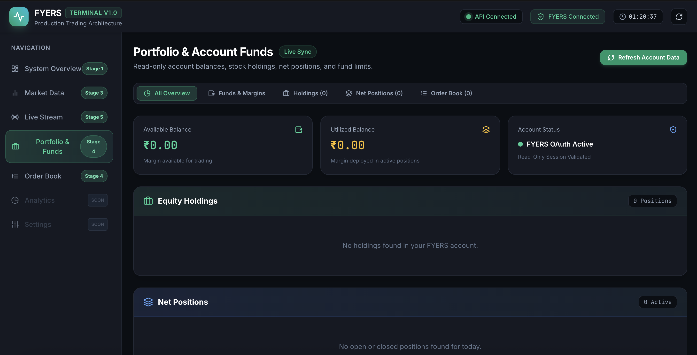

# FYERS Trading Dashboard

[](https://www.python.org/)
[](https://fastapi.tiangolo.com/)
[](https://react.dev/)
[](https://vitejs.dev/)
[](https://tailwindcss.com/)
[](LICENSE)

A full-stack, real-time trading dashboard built with **FastAPI** and **React**, featuring low-latency WebSocket ticker streaming, **TradingView Lightweight Charts**, secure **FYERS OAuth 2.0** authorization, and portfolio analytics.

---

## Overview

The **FYERS Trading Dashboard** interfaces directly with the official **FYERS API v3** platform to deliver real-time market data, interactive candlestick technical analysis, and portfolio management. Built using modern clean architecture principles, the application separates concerns across modular API endpoints, dedicated service layers, Pydantic schemas, and a responsive React frontend.

### Key Highlights
- **Secure OAuth Server-Side Authentication**: State-validated authorization code exchange that keeps API credentials and tokens off client browsers.
- **Low-Latency Streaming Engine**: Multi-client ASGI WebSocket connection manager bound to FYERS' background DataSocket thread.
- **Financial Charting Canvas**: High-performance canvas rendering via TradingView's `@lightweight-charts` library with auto-resizing and crosshairs.
- **Account & Risk Visibility**: Aggregated account margins, stock holdings, net positions, and order execution logs.

---

## Features

- **FYERS OAuth 2.0 Authentication**: Server-side token exchange flow, token state persistence, and automatic session validation.
- **Market Data REST APIs**: High-throughput endpoints for single-symbol quotes, hardcoded 10-symbol benchmark watchlists, and Level 2 market depth.
- **Historical Data Engine**: Configurable OHLCV candle extraction across multiple timeframes (1m to Monthly) with timestamp sorting.
- **Real-Time Ticker Stream**: Event-driven WebSocket server relaying live tick updates for top NSE equity benchmarks (`SBIN`, `RELIANCE`, `TCS`, `INFY`, `HDFCBANK`).
- **Interactive Technical Charts**: Dark-themed candlestick charts with real-time viewport resizing, crosshair inspection, and fallback error boundaries.
- **Portfolio & Account Analytics**: Integrated account margin breakdown, active equity holdings, net derivative positions, and order book history.
- **Production-Grade Resilience**: Unified HTTP error handling, standardized JSON exception payloads, and graceful WebSocket auto-reconnection.
- **Structured Logging**: Centralized Python logging configuration formatted across application modules.

---

## Tech Stack

| Domain | Technologies |
| :--- | :--- |
| **Backend Framework** | [FastAPI](https://fastapi.tiangolo.com/) (Python 3.10+), [Uvicorn](https://www.uvicorn.org/) (ASGI Server) |
| **Frontend Framework** | [React 18](https://react.dev/), [Vite 5](https://vitejs.dev/) |
| **Styling & UI** | [Tailwind CSS 3](https://tailwindcss.com/), [Lucide React Icons](https://lucide.dev/) |
| **Financial Charting** | [TradingView Lightweight Charts v5](https://tradingview.github.io/lightweight-charts/) |
| **API Integration** | [FYERS SDK v3](https://fyers.in/dev_portal/), Axios, Native WebSockets |
| **Data Validation** | [Pydantic v2](https://docs.pydantic.dev/), `pydantic-settings` |
| **Testing & Quality** | [Pytest](https://docs.pytest.org/), FastAPI TestClient |

---

## Project Architecture



### Architecture Component Responsibilities
- **Frontend Layer**: Renders UI components, manages tab navigation, maintains real-time ticker state, and displays candlestick charts.
- **API Layer**: Validates request parameters via Pydantic models, handles CORS policies, and exposes REST/WS routes under `/api/v1`.
- **Service Layer**: Encapsulates FYERS SDK calls, handles thread-safe `asyncio` event loop scheduling, and transforms raw API payloads.
- **Authentication Layer**: Manages `SessionModel` authorization code conversion, access token caching, and client instantiation.
- **WebSocket Layer**: Pools active client WebSocket connections and broadcasts real-time ticker updates.

---

## Folder Structure

```
fyers-trading-dashboard/
├── backend/
│   ├── app/
│   │   ├── api/
│   │   │   └── v1/
│   │   │       ├── router.py             # Master v1 router registration
│   │   │       └── endpoints/
│   │   │           ├── account.py        # Account, funds, holdings & order endpoints
│   │   │           ├── auth.py           # FYERS OAuth login & callback endpoints
│   │   │           ├── health.py         # Diagnostic system health endpoint
│   │   │           ├── market.py         # LTP, history, & depth endpoints
│   │   │           └── market_ws.py      # Real-time market WebSocket route
│   │   ├── core/
│   │   │   ├── config.py                 # Pydantic-settings configuration
│   │   │   └── logging.py                # Centralized logging setup
│   │   ├── schemas/
│   │   │   ├── account.py                # Account & order response models
│   │   │   ├── health.py                 # Health response schema
│   │   │   └── market.py                 # Market quotes & OHLC schemas
│   │   ├── services/
│   │   │   ├── account_service.py        # Account SDK integration
│   │   │   ├── fyers_auth.py             # Auth service & client factory
│   │   │   ├── market_service.py         # Market data SDK integration
│   │   │   └── websocket_service.py      # DataSocket listener & connection manager
│   │   └── main.py                       # FastAPI application entrypoint & lifespan
│   ├── tests/                            # Automated Pytest test suite
│   ├── .env.example                      # Environment configuration template
│   └── requirements.txt                  # Backend Python dependencies
├── frontend/
│   ├── src/
│   │   ├── components/
│   │   │   ├── HealthStatusCard.jsx      # Diagnostic status monitor card
│   │   │   ├── HistoricalChart.jsx       # TradingView Lightweight Charts canvas
│   │   │   └── layout/
│   │   │       ├── MainLayout.jsx        # Root page container layout
│   │   │       ├── Navbar.jsx            # Top navbar & auth controls
│   │   │       └── Sidebar.jsx           # Navigation sidebar
│   │   ├── pages/
│   │   │   ├── MarketPage.jsx            # Market quotes, depth & OHLC charts
│   │   │   ├── MarketWatchPage.jsx       # Live WebSocket ticker watch page
│   │   │   └── PortfolioPage.jsx         # Funds, holdings, positions & order book
│   │   ├── services/                     # Centralized Axios API service functions
│   │   ├── App.jsx                       # Master React component & state manager
│   │   └── index.css                     # Global styles & scrollbars
│   ├── package.json                      # Frontend dependencies & scripts
│   └── vite.config.js                    # Vite configuration & proxy settings
├── .gitignore                            # Version control exclusion rules
└── README.md                             # Project documentation
```

---

## Installation & Setup

### Prerequisites
- **Python**: 3.10 or higher
- **Node.js**: 18.0 or higher
- **FYERS API Credentials**: Active `Client ID` and `Secret Key` from the FYERS Developer Portal

### 1. Clone the Repository
```bash
git clone https://github.com/Siddhesh-repo/fyers-trading-dashboard.git
cd fyers-trading-dashboard
```

### 2. Configure & Run Backend
```bash
# Navigate to backend directory
cd backend

# Create and activate virtual environment
python3 -m venv venv
source venv/bin/activate  # On Windows: venv\Scripts\activate

# Install dependencies
pip install -r requirements.txt

# Copy environment configuration
cp .env.example .env
```

Update `backend/.env` with your FYERS API credentials:
```env
FYERS_CLIENT_ID="YOUR_FYERS_CLIENT_ID"
FYERS_SECRET_KEY="YOUR_FYERS_SECRET_KEY"
FYERS_REDIRECT_URI="http://127.0.0.1:8000/api/v1/auth/callback"
```

Start the backend server:
```bash
uvicorn app.main:app --reload --port 8000
```
- API Base URL: `http://localhost:8000`
- Interactive OpenAPI Docs: `http://localhost:8000/docs`

### 3. Configure & Run Frontend
In a separate terminal window:
```bash
# Navigate to frontend directory
cd frontend

# Install Node.js packages
npm install

# Start Vite development server
npm run dev
```
- Frontend Application URL: `http://localhost:5173`

---

## Environment Variables

The backend uses `pydantic-settings` to load and validate variables from `backend/.env`.

```env
# Application Core Configuration
APP_NAME="Fyers Trading Dashboard API"
APP_ENV="development"
LOG_LEVEL="INFO"

# Allowed CORS Origins (JSON array format)
BACKEND_CORS_ORIGINS=["http://localhost:5173","http://127.0.0.1:5173"]

# FYERS API v3 Credentials
FYERS_CLIENT_ID="YOUR_CLIENT_ID"
FYERS_SECRET_KEY="YOUR_SECRET_KEY"
FYERS_REDIRECT_URI="http://127.0.0.1:8000/api/v1/auth/callback"
```

---

## API Endpoints Reference

| Method | Endpoint | Description | Auth Required |
| :---: | :--- | :--- | :---: |
| `GET` | `/health` | Check API operational status & system timestamp | No |
| `GET` | `/api/v1/health` | Versioned system health check endpoint | No |
| `GET` | `/api/v1/auth/login` | Generate FYERS OAuth authorization redirect URL | No |
| `GET` | `/api/v1/auth/callback` | Handle OAuth authorization code exchange | No |
| `GET` | `/api/v1/auth/status` | Retrieve current FYERS authentication state | No |
| `GET` | `/api/v1/market/ltp` | Fetch Last Traded Price (LTP) for a specific symbol | Yes |
| `GET` | `/api/v1/market/ltp-multiple` | Fetch LTP quotes for top 10 benchmark symbols | Yes |
| `GET` | `/api/v1/market/history` | Retrieve historical OHLCV candle data for a date range | Yes |
| `GET` | `/api/v1/market/depth` | Retrieve Level 2 market depth (5 best bids/asks) | Yes |
| `GET` | `/api/v1/account/funds` | Fetch account equity balance, margin used, and fund limits | Yes |
| `GET` | `/api/v1/account/holdings` | Fetch user stock holdings and current portfolio valuation | Yes |
| `GET` | `/api/v1/account/positions` | Fetch open and closed net positions with P&L | Yes |
| `GET` | `/api/v1/account/orders` | Fetch user order book execution history | Yes |
| `WS` | `/ws/market` | WebSocket stream for live ticker price updates | Yes |

---

## WebSocket Stream Architecture

### Endpoint
`ws://localhost:8000/ws/market`

### Overview
The WebSocket server delivers low-latency market updates for benchmark equity symbols directly to browser clients without HTTP polling.

### Data Flow Sequence
```
[ FYERS DataSocket (Thread) ] 
            │ (Raw Ticks)
            ▼
[ FyersWebsocketManager ] ──► [ ConnectionManager ] ──► [ Client WebSockets ] ──► [ React UI State ]
```

1. **Client Connection**: When a client connects, `ConnectionManager` accepts the socket and transmits cached reference price ticks.
2. **Background Listener**: `FyersWebsocketManager` receives live tick feeds from FYERS servers via a dedicated daemon thread.
3. **Loop Scheduling**: Incoming tick data is thread-safely scheduled onto the main `asyncio` event loop using `run_coroutine_threadsafe`.
4. **Broadcast**: `ConnectionManager` serializes and broadcasts tick JSON payloads to all connected WebSocket clients.

---

## Automated Testing

The backend includes automated integration tests covering endpoints and WebSocket handshakes using Pytest and FastAPI `TestClient`.

Run the backend test suite:
```bash
cd backend
python3 -m pytest
```

---

## Screenshots

| Screen | Preview |
| :--- | :--- |
| **System Overview** |  |
| **Live Market Watch** |  |
| **TradingView Technical Chart** |  |
| **Portfolio & Order Book** |  |

---

## Future Roadmap

- **Order Placement & Modification**: Full order execution workflow (requires FYERS-compliant static IP environment).
- **Custom Symbol Watchlists**: User-created watchlists with persistent local browser storage.
- **Price Alert Notifications**: Browser notification triggers for custom price threshold alerts.
- **Technical Indicators**: Overlay indicators (SMA, EMA, RSI, MACD) on TradingView canvas.
- **Containerization**: Multi-stage Docker container build configurations for deployment.

---

## License

This project is open-source and available under the [MIT License](LICENSE).

---

## Author

- **Siddhesh Pote**
- **GitHub**: [@siddheshpote](https://github.com/Siddhesh-repo)
- **LinkedIn**: [Siddhesh Pote](https://www.linkedin.com/in/siddhesh-pote-58bb56259/)
